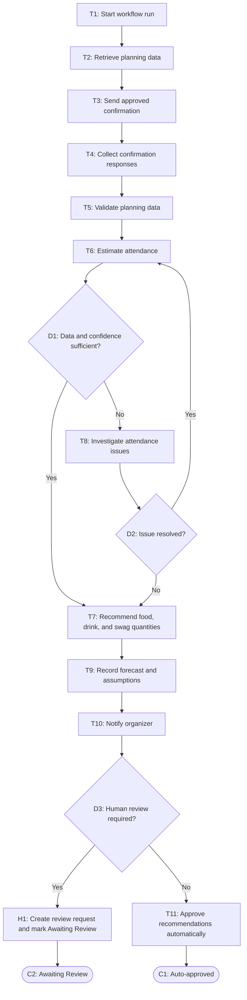

# Workflow of Tasks

## 1. Workflow Overview
### 1.1 Workflow Goal
This workflow supports the system goal defined in `my_first_agent/README.md`.

### 1.2 Workflow Trigger

The workflow run starts when an organizer requests an attendance forecast or at an organizer-defined planning checkpoint before the hackathon.

### 1.3 Completion Condition at Runtime

A run is complete when the attendance forecast, recommended quantities for food, drinks, and swag, the data and rules used to produce them, and the confidence level are recorded and either approved automatically or, when human judgment is required, a human-review request is created and marked "Awaiting Review".

### 1.4 General Workflow

The system retrieves the current registration count, historical attendance rates from comparable CPVC events, registration timing, and any available voluntary attendance confirmations. It sends the approved attendance-confirmation communication to participants, collects the resulting voluntary attendance responses, validates the data, and estimates expected attendance and an uncertainty range. Before recommending quantities, the system checks whether the data and forecast confidence are sufficient. If they are sufficient, the system converts the estimate into recommended quantities for food, drinks, and swag, records the forecast, assumptions, confidence level, recommendations, data, and rules in the planning dashboard, automatically approves the recommendations, and notifies the designated organizer.

If the data is incomplete, contradictory, unusually different from historical patterns, or produces low forecast confidence, the system investigates unresolved attendance issues by selecting and sequencing permitted analyses based on intermediate evidence within predefined limits. If the issue is resolved, the system returns to the estimation step. If it remains unresolved, the system converts the estimate into recommended quantities, records the forecast and related information, notifies the designated organizer, and creates a human-review request marked "Awaiting Review" instead of automatically finalizing the recommendations. An organizer may confirm or adjust the forecast and supply quantities. The system uses only necessary event-planning information, excludes sensitive personal data, and sends at most the approved attendance-confirmation communication.

### 1.5 Workflow Diagram

