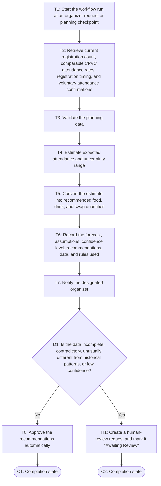

# Workflow of Tasks

*Replace all bracketed prompts with information specific to your proposed system. Delete instructional text that does not belong in your final specification. Add or remove task sections as needed. Every task shown in the general workflow must have a corresponding task specification below.*

## 1. Workflow Overview
### 1.1 Workflow Goal
This workflow supports the system goal defined in `my_first_agent/README.md`.

### 1.2 Workflow Trigger

The workflow run starts when an organizer requests an attendance forecast or at an organizer-defined planning checkpoint before the hackathon.

### 1.3 Completion Condition at Runtime

A run is complete when the attendance forecast, recommended quantities for food, drinks, and swag, the data and rules used to produce them, and the confidence level are recorded and either approved automatically or, when human judgment is required, a human-review request is created and marked "Awaiting Review".

### 1.4 General Workflow

The system retrieves the current registration count, historical attendance rates from comparable CPVC events, registration timing, and any available voluntary attendance confirmations. It validates the data, estimates expected attendance and an uncertainty range, then converts the estimate into recommended quantities for food, drinks, and swag. The system records the forecast, assumptions, confidence level, and recommendations in the planning dashboard and notifies the designated organizer. If the data is incomplete, contradictory, unusually different from historical patterns, or produces low forecast confidence, the system flags the run for human review instead of automatically finalizing the recommendations. An organizer may confirm or adjust the forecast and supply quantities. The system uses only necessary event-planning information, excludes sensitive personal data, and sends at most the approved attendance-confirmation communication.

### 1.5 Workflow Diagram

