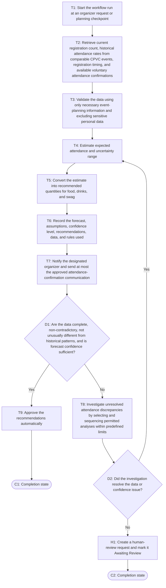

# Workflow of Tasks

## 1. Workflow Overview
### 1.1 Workflow Goal
This workflow supports the system goal defined in `my_first_agent/README.md`.

### 1.2 Workflow Trigger

The workflow run starts when an organizer requests an attendance forecast or at an organizer-defined planning checkpoint before the hackathon.

### 1.3 Completion Condition at Runtime

A run is complete when the attendance forecast, recommended quantities for food, drinks, and swag, the data and rules used to produce them, and the confidence level are recorded and either approved automatically or, when human judgment is required, a human-review request is created and marked "Awaiting Review".

### 1.4 General Workflow

The system retrieves the current registration count, historical attendance rates from comparable CPVC events, registration timing, and any available voluntary attendance confirmations. It validates the data, estimates expected attendance and an uncertainty range, then converts the estimate into recommended quantities for food, drinks, and swag. The system records the forecast, assumptions, confidence level, and recommendations in the planning dashboard and notifies the designated organizer. When the data is complete, non-contradictory, not unusually different from historical patterns, and produces sufficient forecast confidence, the system approves the recommendations automatically, completing the normal path. 

If the data is incomplete, contradictory, unusually different from historical patterns, or produces low forecast confidence, the system investigates unresolved attendance discrepancies by selecting and sequencing permitted analyses based on intermediate evidence within predefined limits. If the investigation resolves the issue, the system returns to the forecasting steps. If the issue remains unresolved, the system flags the run for human review, creates a human-review request, and marks it "Awaiting Review" instead of automatically finalizing the recommendations. An organizer may then confirm or adjust the forecast and supply quantities. The system uses only necessary event-planning information, excludes sensitive personal data, and sends at most the approved attendance-confirmation communication.

### 1.5 Workflow Diagram

